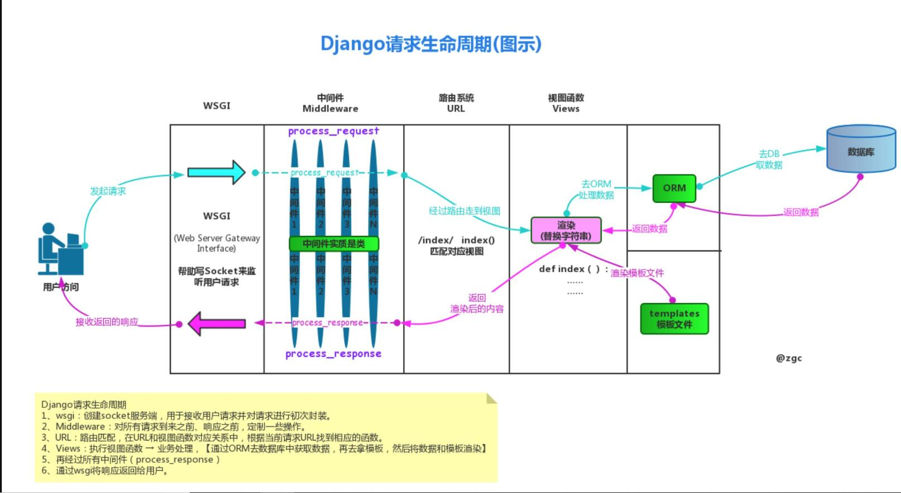

### QuickStart
本文使用的Python解释器版本为`3.6.8`

1、首先我们在本机创建一个专门运行Django的虚拟环境:

```python
mkvirtualenv django_test
```
2、然后进入新创建好的虚拟环境:
```python
workon django_test
```
3、然后在这个虚拟环境中安装指定版本的Django:
```python
pip3 install django==2.2.10
```
4、安装好Django后新建一个Django项目:
```python
django-admin startproject whwDjTest
```
如上所示：我们创建了一个名为whwDjTest的项目。
5、然后我们进入whwDjTest这个项目目录来看看`默认创建`的Django项目的目录结构:
```python
~/Desktop/whwDjTest # 项目目录
├── manage.py # 启动与管理Django项目的模块
└── whwDjTest # 与项目同名的目录
    ├── __init__.py
    ├── settings.py # 项目的本地配置
    ├── urls.py     # 项目的主路由
    └── wsgi.py     # 基于WSGI的socket server
```
6、然后在`项目目录`中新建一个名为`views.py`的模块:
```python
touch views.py
```
新的目录结构如下:
```python
~/Desktop/whwDjTest 
├── manage.py 
├── views.py # 新的视图函数
└── whwDjTest 
    ├── __init__.py
    ├── settings.py 
    ├── urls.py     
    └── wsgi.py    
```
并且在views.py文件中加入下面代码:
```python
# -*- coding:utf-8 -*-
from django.shortcuts import HttpResponse

def index(request):
    if request.method == "GET":
        return HttpResponse("Hello Django!")
```
7、在urls中新加一条路由,并且新的路由交给上面写好的views.py中的index方法去处理：
```python
from django.contrib import admin
from django.urls import path

# 处理视图的模块
import views

urlpatterns = [
    path('admin/', admin.site.urls),
    # 新路由
    path('index/',views.index)
]
```
8、最后，在项目目录下启动Django程序:
```python
python3 manage.py runserver 127.0.0.1:9001
```
9、在浏览器中访问`http://127.0.0.1:9001/index/`即可看到页面打印出的结果:
```python
Hello Django!
```
### Django的请求生命周期
做web开发必须先搞明白前端浏览器发出请求后服务端的具体处理流程以及后端如何处理请求、返回响应。对于Django框架来说弄明白Django的请求生命周期是搞定一切的基础。

下图是Django的请求生命周期，也就是从用户发出请求后服务端返回响应的具体过程:


也就是说，当用户请求到达Django服务端后，请求经过了下面步骤的处理:

1. 首先django框架使用了基于`WSGI`协议的一个socket服务端模块将用户的请求进行封装(通常都会使用`request`变量名来获取这个请求对象)；

2. 接着封装后的`request请求对象`经过`中间件`进行路由分发前的预处理(例如session、csrf校验、权限的校验等等)；

3. 然后根据这个`request请求对象`中的url进行`路由匹配`与`路由分发`，将不同的url分发给对应的`视图函数`去处理；
4. `视图函数`根据业务需求进行业务逻辑的操作；
5. 在视图函数处理业务逻辑时使用`ORM`与数据库进行交互；
6. 视图函数处理完毕后，再经过Django的中间件与socket服务端将结果返回给用户（前后端不分离的项目进行模版渲染或者交给前端框架进行进一步处理）

由于Django使用的是第三方的web socket的服务端(Django自带的是wsgiref模块，线上部署使用的是uwsgi模块)；还有Django的中间件属于比较进阶的内容，因此`概览`这里就不介绍中间件了。本文主要为大家讲一下Django的路由匹配与分发、视图系统、模型层(ORM)、模板层及静态文件的配置基础。

当然在此之前还得为大家介绍一下构成django项目的十分关键的部分——`应用`。

### Django中的应用(application)

Django项目是`模块化`的，也就是说，我们可以根据项目中的不同模块创建相应的应用，这样可以使项目更容易维护并且提升开发的效率。

比如说，现在我们需要为项目创建2个模块，一个是人员管理的`user`模块，另外一个是图书馆里的`book`模块：

1、为项目创建应用

在与`manage.py`同级目录下输入命令创建这两个应用：

```python
python3 manage.py startapp user
python3 manage.py startapp book
```

然后我们可以看到在项目中多了2个目录：user与book：

```python
~/Desktop/whwDjTest 
├── book # 新创建的应用的目录
│   ├── __init__.py
│   ├── admin.py
│   ├── apps.py
│   ├── migrations
│   │   └── __init__.py
│   ├── models.py
│   ├── tests.py
│   └── views.py
├── manage.py
├── user # 新创建的应用的目录
│   ├── __init__.py
│   ├── admin.py
│   ├── apps.py
│   ├── migrations
│   │   └── __init__.py
│   ├── models.py
│   ├── tests.py
│   └── views.py
├── views.py
└── whwDjTest
    ├── __init__.py
    ├── settings.py
    ├── urls.py
    └── wsgi.py
```

2、在Django中`注册`新创建的应用

新创建的应用目录必须在`settings.py`中注册后才能正常使用。

在`与项目同名的目录`下的`settings.py`文件中，找到`INSTALLED_APPS`这个列表，我们可以看到，默认情况下Django已经注册了6个应用，后面的章节我会拿出几个重要的给大家做单独的讲解。

我们需要将自己刚刚创建好的应用注册到这个列表中：

```python
INSTALLED_APPS = [
    'django.contrib.admin',
    'django.contrib.auth',
    'django.contrib.contenttypes',
    'django.contrib.sessions',
    'django.contrib.messages',
    'django.contrib.staticfiles',
    # 自己的应用
    'book.apps.BookConfig',
    'user.apps.UserConfig',
]
```

这里需要注意了：建议大家使用上面的方法（book.apps.BookConfig'而不是只写'book'）去注册应用！

### Django的路由匹配与分发

**一、路由匹配**

当请求到达路由这里时，Django会默认去`与项目同名的目录下的urls.py`文件中匹配路由。

像`Quick Start`里面路由的写法如下(这里多加几个进行说明)：

```python
from django.contrib import admin
from django.urls import path,re_path

# 处理视图的模块
import views

urlpatterns = [
    path('admin/', admin.site.urls),
    # 新路由
    path('index/',views.index)
]
```

默认的一条路由是`path('admin/', admin.site.urls),`Django的后台管理页面的路由，先不用管这个。

我们自己定义了一条路由`index/`(这里省略了域名与端口)，path后面的是`处理这条路由的视图`，关于视图我们后面做介绍。

这里需要注意的一点是，Django2版本的路由引入了path方法进行路由匹配，如果你之前接触过Django1版本的项目，它用的是`url`方法做的路由匹配——url方法做的是正则匹配。

Django2版本有另外一个方法`re_path`与之前的url方法对应，上面的新路由我们也可以写成这样的正则匹配的形式：

```python
re_path('^index/$',views.index),
```

关于path方法后面进阶的介绍会提到。

**二、路由分发**

当然聪明的你看到这里也许会发现一个问题：既然Django可以注册多个app，那么每个app必然会有许多路由，把这些路由都放在一块玩一搞混了怎么办呢？

Django使用路由分发来解决多应用路由可能造成的混乱问题。

1、以user为例，上面我们创建了2个应用但是里面没有路由的文件，我们自己在两个应用中分别创建`urls.py文件`当作是`应用专属的路由处理文件`:

```python
cd user
touch urls.py
```

2、以user为例，然后我们在`跟项目同名的urls.py文件中加入路由分发的逻辑`：

```python
from django.contrib import admin
from django.urls import path,re_path,include

# 处理视图的模块
import views

urlpatterns = [
    path('admin/', admin.site.urls),
    # 新路由
    re_path('^index/$',views.index),
    # 路由分发
    re_path('^user/',include('user.urls'))
]
```

3、以user为例，如果我们想访问user相关的url，这个url是这么设计的：`user/home`。

我们在`user应用下的urls.py文件中加入路由匹配的代码`:

```python
from django.urls import re_path

# 自己处理视图的模块
from user import views

urlpatterns = [
    re_path('^home/$',views.home),
]
```

user的views.py文件中加上视图的处理逻辑：

```python
from django.shortcuts import HttpResponse

def home(request):
    if request.method == "GET":
        return HttpResponse("user home!")
```

4、最后我们在浏览器中访问：`http://127.0.0.1:9001/user/home/`就可以看到浏览器打印出了：

```python
user home!
```

### Django的视图系统简介

上面在介绍路由系统的时候，对于每一个路由都有一个函数(也可以使用类)去处理，这个函数(后面会介绍类)或者类就是Django的视图函数(或者叫视图类)。

也就是说，Django的视图系统是在路由匹配成功之后进行的后段逻辑处理的地方，值得注意的是，每一个视图的第一个参数必须是`请求对象request`,这个request对象就是WSGI服务端与中间件处理完毕后的请求对象，里面封装了许多属性与方法。上面代码中的视图返回的都是HttpResponse对象(实际上可以返回3个响应对象)。

关于request与response对象的属性与方法会在后续章节中详细为大家介绍。大家只需要牢记一点：视图系统是处理后段业务的核心所在地，我们常常说的`CV工程师`、`CURD搬运工`所涉及到的代码绝大部分都是在这里完成的！

个人认为Django的视图系统起到了一个`承上启下`的作用，在这里拿到封装后的请求对象，经过业务逻辑处理将处理后的响应对象返回给前端进行模板渲染或者进行其他的处理。

### 视图系统之FBV与CBV简介

说白了，FBV就是视图中以函数的方式处理请求，CBV就是以面向对象的方式处理请求。

上面给大家介绍的是FBV的写法，下面简单介绍一下CBV的写法：

1、还拿第一个index路由举例，在views.py中加入CBV处理的逻辑：

```python
# -*- coding:utf-8 -*-
from django.shortcuts import HttpResponse
from django.views import View


class Index(View):
    def get(self,request):
        return HttpResponse("Hello Django!")
```

2、这时路由的写法需要改成这种形式：

```python
from django.contrib import admin
from django.urls import path,re_path,include

# 处理视图的模块
import views

urlpatterns = [
    path('admin/', admin.site.urls),
    # 新路由 —— CBV的写法
    re_path('^index/$',views.Index.as_view()),
]
```

然后像上面那样访问index页面就好了。

### Django与MySQL的交互

与Flask等其他Python框架不同的是，Django的模型层与数据库交互用的是自己的ORM框架。

本文简单介绍一下Django与MySQL数据库交互的过程以及ORM的基本使用，后续章节会详细展开说明。

**一、创建数据库**

在MySQL中创建一个名为`test`的数据库当作是测试的数据库。

**二、创建模型Model**

以上面创建的`user`应用为例，在`user/models.py`文件中加入创建的数据模型：

```python
from django.db import models

# Create your models here.

class User(models.Model):
    id = models.AutoField(primary_key=True)
    name = models.CharField(max_length=22)
    age = models.IntegerField()

    def __str__(self):
        return self.name
```

可以看到：我们创建了一个user模型，里面有3个属性：id(主键)、name、age。

**三、在settings中配置数据库的连接**

在与项目同名的目录中的settings.py文件中找到`DATABASES`这个字典，将里面的配置改成MySQL的连接配置：

```python
DATABASES = {
    'default': {
        'ENGINE': 'django.db.backends.mysql',#引擎，选mysql
        'NAME':'test',#要连接的数据库，连接前需要创建好
        'USER':'root',#连接数据库的用户名
        'PASSWORD':'123',#连接数据库的密码
        'HOST':'127.0.0.1',#连接主机，默认本本机
        'PORT':3306,#端口 默认3306
        #Django中设置数据库的严格模式
        'OPTIONS':{
            'init_command':"set sql_mode='STRICT_TRANS_TABLES' ",
            }
        }
    }
```

如果此时就启动项目会报错：

```python
django.core.exceptions.ImproperlyConfigured: Error loading MySQLdb module.
Did you install mysqlclient?
```

提示我们没有安装mysql客户端，MySQLdb对于py3有很大问题，所以我们需要的驱动是pymysql。

**四、在与项目同名的目录中的`__init__.py`文件中导入pymysql模块并加入MySQLdb**

由于新创建的虚拟环境中没有pymysql模块，我们需要先安装一下：

```python
pip3 install pymysql
```

然后加入MySQLdb：

```python
import pymysql

pymysql.install_as_MySQLdb()
```

**五、如果使用Django2版本需要修改2处源码**

**（1）如果此时运行项目的话会报错：**

```python
django.core.exceptions.ImproperlyConfigured: mysqlclient 1.3.13 or newer is required; you have 0.9.3.
```

这是Django2内部的一个版本限制的问题，我们需要修改一下源码。

找到当前这个虚拟环境的目录下的django对应的配置，具体的目录是：

```python
/(你自己的家目录)/venvs/django_test/lib/python3.6/site-packages/django/db/backends/mysql/base.py
```

这个`base.py`文件中有这两行代码：

```python
if version < (1, 3, 13):
    raise ImproperlyConfigured('mysqlclient 1.3.13 or newer is required; you have %s.' % Database.__version__)
```

`把这两行代码注释掉！`

**（2）再运行项目还会报错：**

```python
AttributeError: 'str' object has no attribute 'decode'
```

对应报错的文件在这里：

```python
/(你自己的家目录)/venvs/django_test/lib/python3.6/site-packages/django/db/backends/mysql/operations.py
```

这个文件的146行：

```python
query = query.decode(errors='replace')
```

`改成encode:`

```python
query = query.encode(errors='replace')
```

这样就没问题了！

**六、执行数据库迁移指令**

在项目的跟目录下执行数据库的迁移指令：

```python
python3 manage.py makemigrations
'''
Migrations for 'user':
  user/migrations/0001_initial.py
    - Create model User
'''

python3 manage.py migrate
'''
Operations to perform:
  Apply all migrations: admin, auth, contenttypes, sessions, user
Running migrations:
  Applying contenttypes.0001_initial... OK
  Applying auth.0001_initial... OK
  Applying admin.0001_initial... OK
  Applying admin.0002_logentry_remove_auto_add... OK
  Applying admin.0003_logentry_add_action_flag_choices... OK
  Applying contenttypes.0002_remove_content_type_name... OK
  Applying auth.0002_alter_permission_name_max_length... OK
  Applying auth.0003_alter_user_email_max_length... OK
  Applying auth.0004_alter_user_username_opts... OK
  Applying auth.0005_alter_user_last_login_null... OK
  Applying auth.0006_require_contenttypes_0002... OK
  Applying auth.0007_alter_validators_add_error_messages... OK
  Applying auth.0008_alter_user_username_max_length... OK
  Applying auth.0009_alter_user_last_name_max_length... OK
  Applying auth.0010_alter_group_name_max_length... OK
  Applying auth.0011_update_proxy_permissions... OK
  Applying sessions.0001_initial... OK
  Applying user.0001_initial... OK
'''
```

每次有上面这样的提示说明数据库迁移成功了！

**七、查看数据库生成的表**

进入数据库我们看看生成的表：

```python
mysql -uroot -p


use test;
show tables;
'''
+----------------------------+
| Tables_in_test             |
+----------------------------+
| auth_group                 |
| auth_group_permissions     |
| auth_permission            |
| auth_user                  |
| auth_user_groups           |
| auth_user_user_permissions |
| django_admin_log           |
| django_content_type        |
| django_migrations          |
| django_session             |
| user_user                  |
+----------------------------+
'''
```

生成的这些表中，`auth`与`django`为前缀的表是django自动生成的，最后那个`user_user`表是我们自己创建的表：第一个user表示的是`user应用`第二个user表示`表的名字`(就是我们的Model类的小写)。

**八、查看user_user的表结构**

```python
mysql> desc user_user;
+-------+-------------+------+-----+---------+----------------+
| Field | Type        | Null | Key | Default | Extra          |
+-------+-------------+------+-----+---------+----------------+
| id    | int(11)     | NO   | PRI | NULL    | auto_increment |
| name  | varchar(22) | NO   |     | NULL    |                |
| age   | int(11)     | NO   |     | NULL    |                |
+-------+-------------+------+-----+---------+----------------+
3 rows in set (0.00 sec)
```

表结构是根据我们上面的Model类的语法创建的。具体Model的属性与MySQL表结构的对应关系后面详细讲解。

**九、往数据库中写入一些数据**

这一步略去，当然实际中的方法非常多，由于本文只是一个大纲，这里我使用insert语句往数据库中写入3条数据：

```mysql
mysql> insert into user_user(name,age) values("wanghw",18),("naruto",28),("sasuke",38);
Query OK, 3 rows affected (0.00 sec)
Records: 3  Duplicates: 0  Warnings: 0
            
mysql> select * from user_user;
+----+--------+-----+
| id | name   | age |
+----+--------+-----+
|  1 | wanghw |  18 |
|  2 | naruto |  28 |
|  3 | sasuke |  38 |
+----+--------+-----+
3 rows in set (0.00 sec)
```

### ORM的简单使用

ORM(Object Relational Mapping)对象关系映射，简单而言其实就是让程序员使用面向对象的方式操作数据库中的数据，虽然有些极端的情况下性能上要低于执行原生SQL的效率，但是绝大多数的情况下都可以满足用户的需求（在ORM中也可以执行原生SQL，后面会介绍）。

其实上面`Django与MySQL的交互`部分介绍的内容就已经做了Django程序与MySQL数据库的关联，我们现在只需要使用ORM语法就可以操作数据库了。

以上面`Django路由匹配与分发`介绍的`user/home/`这个路由为例：我们在user这个应用的views中加入ORM的查询语法，然后访问`http://127.0.0.1:8001/user/home/`

```python
from django.shortcuts import HttpResponse

# 导入Model
from user import models

def home(request):
    if request.method == "GET":
        # 查询
        ret1 = models.User.objects.filter(name="wanghw")
        print(ret1,type(ret1)) #<QuerySet [<User: wanghw>]> <class 'django.db.models.query.QuerySet'>

        ret2 = models.User.objects.first()
        print(ret2,type(ret2)) # wanghw <class 'user.models.User'>

        return HttpResponse("user home!")
```

我们可以看到，ret1得出来的是一个`QuerySet对象`，而ret2得到的是一个`model对象`。本节只像大家简单介绍一下如何使用面向对象的方式去操作数据库，关于QuerySet对象与Model对象的各种方法与区别后续会详细介绍。

**当然我们也可以插入一条数据：**

```python
from django.shortcuts import HttpResponse

# 导入Model
from user import models

def home(request):
    if request.method == "GET":
        # 插入数据
        user_obj = models.User.objects.create(name="张三",age=66)
        print(user_obj)

        return HttpResponse("user home!")
```

在数据库中检验一下是否插入成功：

```mysql
mysql> select * from user_user;
+----+--------+-----+
| id | name   | age |
+----+--------+-----+
|  1 | wanghw |  18 |
|  2 | naruto |  28 |
|  3 | sasuke |  38 |
|  4 | 张三   |  66 |
+----+--------+-----+
4 rows in set (0.00 sec)
```

**修改与删除数据也是可以的：**

```python
from django.shortcuts import HttpResponse

# 导入Model
from user import models

def home(request):
    if request.method == "GET":
        # 修改数据
        models.User.objects.filter(name="张三").update(age=100)

        # 删除数据
        models.User.objects.filter(name="sasuke").delete()

        return HttpResponse("user home!")

```

再看一下MySQL中的结果：

```python
mysql> select * from user_user;
+----+--------+-----+
| id | name   | age |
+----+--------+-----+
|  1 | wanghw |  18 |
|  2 | naruto |  28 |
|  4 | 张三   | 100 |
+----+--------+-----+
3 rows in set (0.00 sec)
```

### Django的模板系统

对于前后端不分离的项目来说，Django的模板系统是与前端交互的关键，这里先简单介绍一下Django模板的使用。

在项目的根目录下，新建一个名为`templates`的目录：

```PYTHON
mkdir templates
```

然后进入这个目录创建一个`index.html`文件：

```python
cd templates
touch index.html
```

index.html中的内容如下：

```python
<!DOCTYPE html>
<html lang="en">
<head>
<meta charset="UTF-8">
<title>Title</title>
</head>
<body>

<h4>当前时间:{{ ctime }}</h4>

    </body>
    </html>
```

**settings中的配置**

需要注意一点，我们以命令的方式创建Django项目的话，默认的配置中没有为我们加入templates的目录，在`settings.py`中找到`TEMPLATES`这个列表，为里面的`'DIRS'`这个key加入刚刚创建好的templates的目录：

```python
'DIRS': [os.path.join(BASE_DIR, "templates")],
```

然后我们在` http://127.0.0.1:9001/index/ `这条路由做测试：

对应的views.py中加入下面的代码：

```python
from diango.shortcuts import render 
    #这个函数必须要带一个形参request
    def index(request):
        import datetime
        now = datetime.datetime.now()
        ctime = now.strftime('%Y-%m-%d %X')
        #注意这里必须得return 而且第一个参数必须是request
        return reder(request,'index.html',{'ctime':ctime})
```

最后访问index这个路由就可以看到当前页面返回的信息了。

index.html页面中`{{ ctime }}`这个是Django的模板语言，对应的ctime是后端返回的数据，后面的章节会为大家详细讲解模板语言与模板中的其他高级用法。

最后，如果您觉得本教程指南对您有帮助的话，欢迎为笔者打赏，感谢您的支持！

